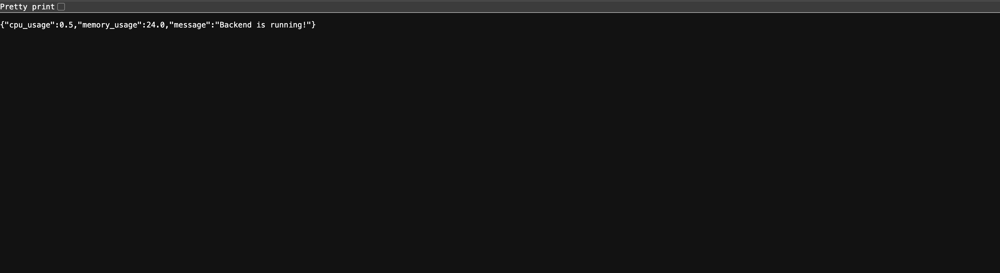
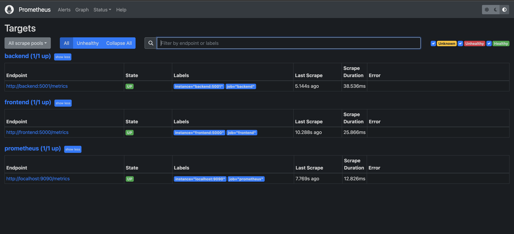
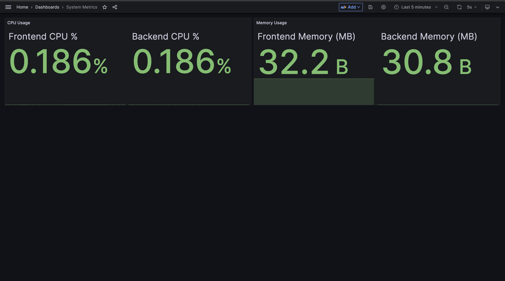

# DevOps-Final-Project

This is a comprehensive multi-service application demonstrating modern DevOps practices including containerization, monitoring, security scanning, and automated deployment using Ansible.

## 🏗️ Architecture Overview

This project consists of a multi-tier architecture with the following components:

- **Frontend Service**: Flask-based web application serving the user interface
- **Backend Service**: Flask-based API providing data and system metrics
- **Monitoring Stack**: Prometheus for metrics collection and Grafana for visualization
- **Security**: Trivy container image vulnerability scanning
- **Orchestration**: Docker Compose for service orchestration
- **Automation**: Ansible playbook for automated deployment

## 📋 Prerequisites

Before running this project, ensure you have the following installed:

- Docker and Docker Compose
- Ansible
- Python 3.9+
- Trivy (for security scanning)
  - macOS: `brew install trivy`
  - Linux: Follow [Trivy installation guide](https://aquasecurity.github.io/trivy/latest/getting-started/installation/)

## 🚀 Start

### Option 1: Automated Deployment

Deploy the entire stack using the Ansible playbook:

```bash
# Clone the repository
git clone <your-repo-url>
cd devops-final-project

# Run the Ansible playbook
ansible-playbook ansible/playbook.yml -i ansible/inventory
```

### Option 2: Manual Deployment

```bash
# Build and start services
docker-compose build
docker-compose up -d

# Verify services are running
docker-compose ps
```

## 🛠️ Services Overview

### Frontend Service
- **Port**: 5000
- **Technology**: Flask + HTML templates
- **Features**:
  - Web interface for the application
  - Communicates with backend API
  - Prometheus metrics endpoint (`/metrics`)
  - Request counting and latency tracking


### Backend Service
- **Port**: 5001
- **Technology**: Flask + psutil
- **Features**:
  - REST API endpoint (`/data`)
  - System monitoring (CPU and memory usage)
  - Prometheus metrics endpoint (`/metrics`)
  - Real-time system statistics



### Monitoring Stack

#### Prometheus
- **Port**: 9090
- **Purpose**: Metrics collection and storage
- **Configuration**: `monitoring/prometheus/prometheus.yml`
- **Targets**:
  - Frontend service metrics
  - Backend service metrics
  - Self-monitoring



#### Grafana
- **Port**: 3000
- **Purpose**: Metrics visualization and dashboards
- **Default Credentials**: 
  - Username: `admin`
  - Password: `admin123` (configured via `.env`)
- **Features**:
  - Pre-configured dashboards
  - Real-time system metrics visualization
  - CPU and memory usage monitoring



## 🔧 Configuration

### Environment Variables

Create a `.env` file in the project root:

```env
GRAFANA_ADMIN_PASSWORD=admin123
```

### Service Configuration

The application uses Docker Compose with the following network configuration:
- **Network**: `app-network` (bridge driver)
- **Service Discovery**: Services communicate using container names
- **Secrets**: API key stored in `api_key.txt`

## 📊 Monitoring Implementation

### Metrics Collection

Both frontend and backend services expose Prometheus metrics on port 8000:

**Frontend Metrics**:
- `request_count`: Total number of requests
- `request_latency_seconds`: Request processing time

**Backend Metrics**:
- `request_count`: Total number of requests  
- `request_latency_seconds`: Request processing time
- `cpu_usage_percent`: Real-time CPU usage
- `memory_usage_percent`: Real-time memory usage

### Dashboard Configuration

Grafana dashboards are automatically provisioned with:
- CPU usage statistics for both services
- Memory consumption tracking
- Real-time updates every 5 seconds
- 5-minute time window for metrics

Access the dashboard at: `http://localhost:3000`

## 🔒 Security Implementation

### Container Security Scanning

The project implements automated security scanning using Trivy:

**Ansible Integration**:
- Scans are performed during deployment
- Supports both explicit and auto-generated image names
- Results saved in JSON format for further analysis

**Manual Scanning**:
```bash
# Scan frontend image
trivy image frontend:latest

# Scan backend image  
trivy image backend:latest
```

### Security Features

- **Image Scanning**: Vulnerability assessment for all container images
- **Secrets Management**: API keys stored as Docker secrets
- **Network Isolation**: Services communicate through dedicated bridge network
- **Minimal Base Images**: Using `python:3.9-slim` for reduced attack surface

## 🤖 Ansible Automation

The Ansible playbook (`ansible/playbook.yml`) automates the entire deployment process:

### Deployment Steps

1. **Environment Setup**: Ensures Trivy is installed (macOS support)
2. **Image Building**: Builds Docker images using docker-compose
3. **Security Scanning**: Scans all images for vulnerabilities
4. **Service Deployment**: Starts all services using docker-compose
5. **Health Checking**: Verifies service status and generates deployment summary

### Inventory Configuration

The inventory file (`ansible/inventory`) is configured for localhost deployment:
```ini
[localhost] 127.0.0.1 ansible_connection=local
```

### Playbook Features

- **Error Handling**: Graceful handling of missing images or scan failures
- **Dynamic Image Detection**: Automatically detects built image names
- **Comprehensive Reporting**: Detailed deployment summary with service status
- **Flexible Scanning**: Adapts to different image naming conventions

## 📁 Project Structure

```
devops-final-project/
├── ansible/
│   ├── inventory              # Ansible inventory configuration
│   └── playbook.yml          # Main deployment playbook
├── backend/
│   ├── app.py                # Backend Flask application
│   ├── Dockerfile            # Backend container configuration
│   └── requirements.txt      # Python dependencies
├── frontend/
│   ├── app.py                # Frontend Flask application
│   ├── Dockerfile            # Frontend container configuration
│   ├── requirements.txt      # Python dependencies
│   └── templates/
│       └── index.html        # HTML template
├── monitoring/
│   ├── grafana/provisioning/
│   │   ├── dashboards/
│   │   │   └── dashboard.yml # Dashboard configuration
│   │   └── datasources/
│   │       └── datasource.yml# Prometheus datasource config
│   └── prometheus/
│       └── prometheus.yml    # Prometheus configuration
├── .env                      # Environment variables
├── docker-compose.yml        # Service orchestration
└── api_key.txt              # API key secret
```

## 🌐 Access Points

After deployment, access the services at:

- **Frontend Application**: http://localhost:5000
- **Backend API**: http://localhost:5001/data
- **Prometheus**: http://localhost:9090
- **Grafana**: http://localhost:3000

## 🔍 Troubleshooting

### Common Issues

**Services not starting**:
```bash
# Check service logs
docker-compose logs [service-name]

# Restart services
docker-compose restart
```

**Monitoring not working**:
```bash
# Verify Prometheus targets
curl http://localhost:9090/targets

# Check Grafana datasource
curl http://localhost:3000/api/datasources
```

**Security scan failures**:
```bash
# Manual Trivy scan
trivy image --format table <image-name>

# Update Trivy database
trivy image --download-db-only
```

## 🚦 Health Checks

Verify deployment status:

```bash
# Check all services
docker-compose ps

# Test frontend
curl http://localhost:5000

# Test backend API
curl http://localhost:5001/data

# Test metrics endpoints
curl http://localhost:5000/metrics
curl http://localhost:5001/metrics
```

## 🔄 Development Workflow

1. **Code Changes**: Modify application code
2. **Rebuild**: `docker-compose build`
3. **Security Scan**: `trivy image <image-name>`
4. **Deploy**: `docker-compose up -d`
5. **Monitor**: Check Grafana dashboards
6. **Automate**: Use Ansible playbook for full deployment

---
